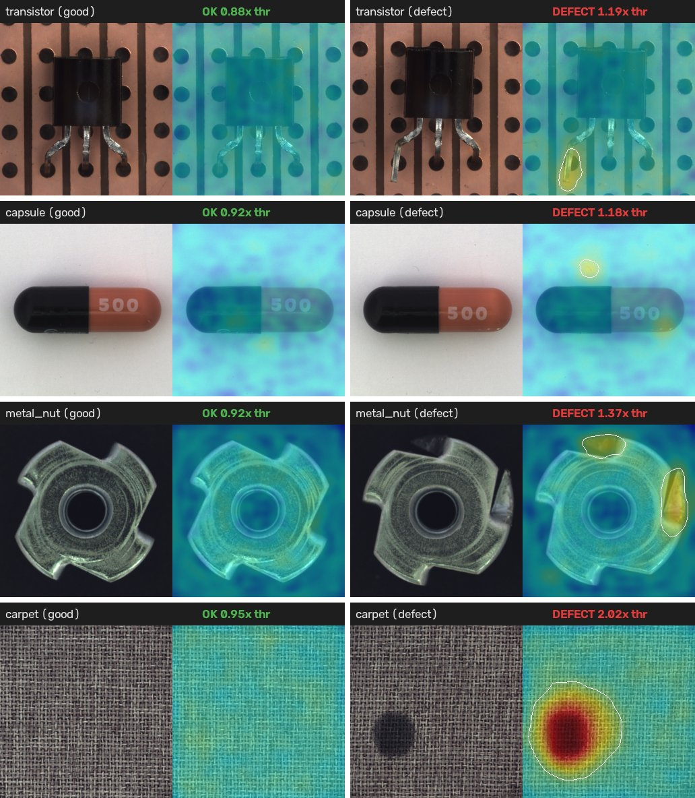
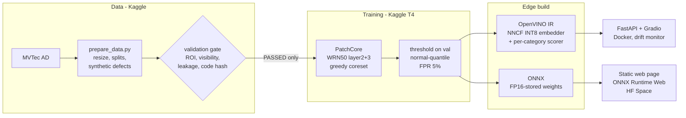

# DefectLens

**Unsupervised industrial defect detection that learns from good parts only, runs at 24 FPS on a laptop CPU, and also runs entirely in a web browser.**

[](https://github.com/trgkhiemm-beep/defectlens/actions/workflows/ci.yml)
[](https://huggingface.co/spaces/khiem05/defectlens)


On a production line, defective parts are rare (often under 1%) and every defect looks different, so there is
never enough labelled data to train a supervised detector. DefectLens implements **PatchCore** (Roth et al.,
CVPR 2022) from scratch: it memorises what *normal* looks like and flags anything far from it, then localises
the defect with a heatmap. It covers four MVTec AD categories chosen to mirror Vietnam's manufacturing base:
electronics (`transistor`), pharmaceuticals (`capsule`), mechanical parts (`metal_nut`) and textiles (`carpet`).

**[Live demo](https://huggingface.co/spaces/khiem05/defectlens):** the model runs in your browser (ONNX Runtime Web). No server, and the image never leaves your device.



## Results at a glance

| | Result |
|---|---|
| Accuracy (4 categories, MVTec AD test split) | image AUROC **0.989**, pixel AUROC **0.987**, AUPRO@0.3 **0.944** |
| Operating point (threshold chosen on validation data only) | mean F1 **0.964** at a 5% false-reject target (up from 0.846 with the first policy, see [lessons](#engineering-decisions-and-lessons)) |
| Edge model (OpenVINO INT8 backbone + 1% memory bank) | **41 ms / 24 FPS** on an i5-1135G7 CPU, **4.7x faster** than PyTorch eager with the same bank, AUROC -0.001 |
| Size | **47.5 MB** deployment bundle for all 4 categories (vs 197 MB for one PyTorch FP32 model with a 10% bank) |
| Browser build | 70 MB ONNX, scores identical to the Python pipeline to 4 decimals |
| Engineering | data validation gate, dataset lineage, 48 tests, CI (tests + Docker build) |

## Architecture



The model is split in two so that it scales to many product types: one shared **embedder** (the frozen CNN,
INT8-quantised once) and one small **scorer** per category (its memory bank plus nearest-neighbour search and
heatmap smoothing). Adding a product means adding a 5 MB scorer, not another backbone.

## Detailed results

### Accuracy (PatchCore, WideResNet50, 10% coreset, PyTorch FP32)

| Category | Industry | Image AUROC | Pixel AUROC | AUPRO@0.3 |
|---|---|---|---|---|
| transistor | electronics | 0.999 | 0.978 | 0.951 |
| capsule | pharma | 0.974 | 0.990 | 0.934 |
| metal_nut | mechanical | 0.997 | 0.990 | 0.943 |
| carpet | textile | 0.986 | 0.991 | 0.949 |
| **mean** | | **0.989** | **0.987** | **0.944** |

Trained on 80% of the defect-free training images; the other 20% are held out to choose the threshold, so the
test split is never used for tuning.

### Threshold policy (F1 on the test split, threshold chosen on validation data)

| Category | `val_f1` (v1) | `normal_quantile` @ 5% FPR (v2, deployed) | Oracle (peeks at test) |
|---|---|---|---|
| transistor | 0.988 | 0.976 | 0.988 |
| capsule | **0.486** | **0.962** | 0.982 |
| metal_nut | 0.989 | 0.989 | 0.989 |
| carpet | 0.922 | 0.927 (FPR 0.50, see drift below) | 0.972 |
| **mean** | 0.846 | **0.964** | 0.983 |

### Edge accuracy vs size (mean over 4 categories)

| Embedder | Memory bank | Image AUROC | AUPRO@0.3 | F1 | Banks, all categories |
|---|---|---|---|---|---|
| FP32 (94.8 MB) | 10% | 0.9888 | 0.9441 | 0.964 | 224 MB |
| FP32 | 1% | 0.9880 | 0.9386 | 0.970 | 22.4 MB |
| **INT8 (23.8 MB)** | **1%** | **0.9878** | **0.9420** | **0.972** | **22.4 MB** |
| INT8 | 0.1% | 0.9723 | 0.8898 | 0.923 | 2.2 MB |

Full table, including the `int8mix` calibration experiment: [docs/results/edge_accuracy.md](docs/results/edge_accuracy.md).

### Latency on a laptop (Intel i5-1135G7, 15 W, batch 1, end to end)

| Runtime | Device | 1% bank, p50 [min-max over 3 repeats] | FPS |
|---|---|---|---|
| PyTorch eager FP32 | CPU | 194 ms [188-624] | 5.2 |
| OpenVINO FP32 | CPU | 88 ms [88-89] | 11.4 |
| **OpenVINO INT8** | **CPU** | **41 ms [41-42]** | **24.4** |
| OpenVINO FP32 | Iris Xe iGPU | 33 ms [33-126] | 30.0 |
| OpenVINO INT8 | Iris Xe iGPU | 54 ms [50-62] | 18.5 |

On the CPU the CNN takes 157 ms in PyTorch eager, 66 ms in OpenVINO FP32 and 20 ms in OpenVINO INT8 (VNNI);
INT8 gives nothing on the iGPU, which already runs FP16. Protocol and all configurations: [docs/results/benchmark_i5-1135G7.md](docs/results/benchmark_i5-1135G7.md).

## Engineering decisions and lessons

Each of these started as a wrong number or a failing run.

1. **A validation gate for data, not just for models.** The first synthetic defects landed on the PCB instead of
   the transistor, and some were invisible. Now `prepare_data.py` re-checks the dataset from disk (defect inside
   the inspection ROI, visible contrast, one region, no train/val leakage) and hashes the code that built it;
   training refuses a dataset that did not pass. It later caught a repo that mixed old and new files.
2. **A good AUROC is not a good threshold.** Capsule had AUROC 0.974 but F1 0.486: the threshold was tuned on
   synthetic defects that were far easier than real cracks. The fix picks the threshold from real normal images
   only, for a target false-reject rate, which is how quality teams set it on a line (F1 0.486 to 0.962).
3. **Detecting drift instead of hiding it.** Carpet still rejects 50% of good parts: its test normals score 9%
   higher than validation normals (p95 1.49 to 1.86), so no validation-only threshold can work. The service
   monitors the median score of accepted parts and flags drift; the analysis script measures how many new
   normal samples a recalibration needs.
4. **INT8 can erase the signal you detect.** Quantising the nearest-neighbour scorer was 2.3x faster but
   collapsed anomaly scores to normal level (79 to 15.6): activation ranges calibrated on normal data clip exactly
   the out-of-distribution values. The scorer stays FP32; only the CNN is INT8. Calibrating the CNN with synthetic
   defects added (`int8mix`) gave no measurable gain, and that negative result is reported too.
5. **Benchmarks lie until proven otherwise.** A first table claimed a 61x speed-up. Two bugs: importing OpenVINO
   in the same process slowed PyTorch 5x (clashing thread pools), and the 15 W laptop throttled 8x after heavy
   runs. Now every configuration runs in its own process, after a cool-down, repeated round-robin.
6. **The bottleneck was not the network.** With a 10% memory bank, nearest-neighbour search costs 55 GFLOP
   per image, 2.3x the CNN (24 GFLOP, measured). Shrinking the bank to 1% cost 0.001 AUROC; a separable Gaussian blur cut the
   post-processing from about 20 ms to a few ms at identical output.
7. **No side effects at import.** CI failed while every local test passed: the web app loaded a model at import
   time from a folder that exists only on a dev machine. It is now an app factory, with a regression test.

## Known limitations

- **Small test sets:** capsule and metal_nut have about 22 normal test images, so one image moves FPR by about 4.5%.
- **Right verdict, wrong place:** on the capsule sample shown above, the above-threshold region lies on the
  background above the capsule, not on the capsule. Image-level metrics do not reveal this; region-level error
  analysis is the next step.
- **metal_nut:** 2 of 22 normal test images score above every threshold, including the oracle one.
- **Synthetic defects cannot express logical anomalies** (a missing or misplaced part), so they are used to check
  localisation, not to pick the threshold.
- MVTec AD is licensed CC BY-NC-SA 4.0: this project and its models are for non-commercial use.

## Repository layout

```
configs/        data.yaml (category-aware augmentation, ROI), patchcore.yaml
src/data/       dataset, synthetic defects, transforms, validation gate
src/models/     PatchCore: Embedder, Scorer, greedy coreset
src/eval/       AUROC, AUPRO, threshold policies, drift and recalibration analysis
src/edge/       OpenVINO export + INT8, runtime (EdgeInspector), preprocessing
scripts/        prepare_data, train_patchcore, analyze_thresholds, build_edge, benchmark,
                export_bundle, export_web, make_space, serve_web,
                make_test_pack, inspect_folder, make_edge_cases (testing)
app/            FastAPI service (+ drift monitor) and Gradio UI
web/            static in-browser demo (ONNX Runtime Web)
tests/          48 tests, all on small generated data (no downloads)
docs/results/   accuracy and benchmark tables
```

## How to run

**Train and evaluate (Kaggle, GPU T4, internet on, MVTec AD added as input):**

```bash
pip install -r requirements.txt
python scripts/prepare_data.py --src /kaggle/input/<mvtec-folder> --dst data/processed --overwrite
python scripts/train_patchcore.py --data data/processed --out artifacts/patchcore
python scripts/analyze_thresholds.py --artifacts artifacts/patchcore
python scripts/build_edge.py --data data/processed --out artifacts/edge
```

**Benchmark on your machine** (after copying `artifacts/edge` from Kaggle):

```bash
python scripts/benchmark.py --edge artifacts/edge --devices CPU GPU --embedders fp32 int8 --banks r0.1 r0.01
```

**Serve the API and UI** (FastAPI + Gradio on http://localhost:7860, OpenAPI docs at `/docs`):

```bash
python scripts/export_bundle.py --edge artifacts/edge --precision int8 --bank r0.01 --out deploy/model
uvicorn app.main:create_app --factory --port 7860
```

or with Docker: `docker compose up --build`.

**In-browser build** (what the Hugging Face Space serves):

```bash
python scripts/export_web.py --edge artifacts/edge --variant fp32/r0.01
python scripts/serve_web.py   # http://127.0.0.1:8765, with the COOP/COEP headers multi-threaded WASM needs
```

**Tests:** `pytest -q` (runs on CPU with small generated images). Full testing guide, including how to get test images: [docs/TESTING.md](docs/TESTING.md) (Vietnamese).

## References

- K. Roth et al., *Towards Total Recall in Industrial Anomaly Detection*, CVPR 2022 (PatchCore).
- P. Bergmann et al., *MVTec AD: A Comprehensive Real-World Dataset for Unsupervised Anomaly Detection*, CVPR 2019.
- V. Zavrtanik et al., *DRAEM*, ICCV 2021 (inspiration for the synthetic defects).
